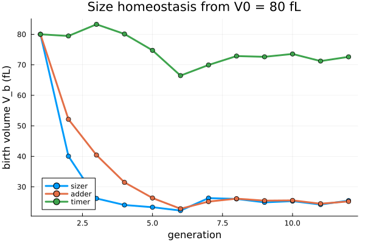

# Tutorial — watch the sizer at work

A cell can control its size three ways: a **timer** (divide after a fixed time), an **adder**
(add a fixed volume), or a **sizer** (divide at a fixed target size). Budding yeast uses an
inhibitor-dilution **sizer** — Whi5 is diluted as the cell grows and Start fires at a threshold.

The figure starts three lineages at the same perturbed birth size (80 fL) and follows their
birth volume across generations. The **sizer** corrects the error within a generation and holds a
steady size; the **adder** drifts slowly; the **timer** never forgets.

The tell-tale is the **slope of division size on birth size** — ~0 for a sizer, ~1 for an adder,
~2 for a timer — asserted in the package's tests against the Soifer–Amir 2016 benchmark.

## Run it interactively

The full [Pluto](https://plutojl.org) notebook lets you pick the rule and drag the starting size,
the noise, and the number of generations, and shows the division-vs-birth discriminator slope:

- **Notebook:** [`notebook/sizer_lineage_explorer.jl`](https://github.com/djsegal/CellSizeControl.jl/blob/main/notebook/sizer_lineage_explorer.jl)
- **Run it:** install [Pluto](https://plutojl.org) (`import Pkg; Pkg.add("Pluto")`), then
  `using Pluto; Pluto.run()` and open the notebook file.
